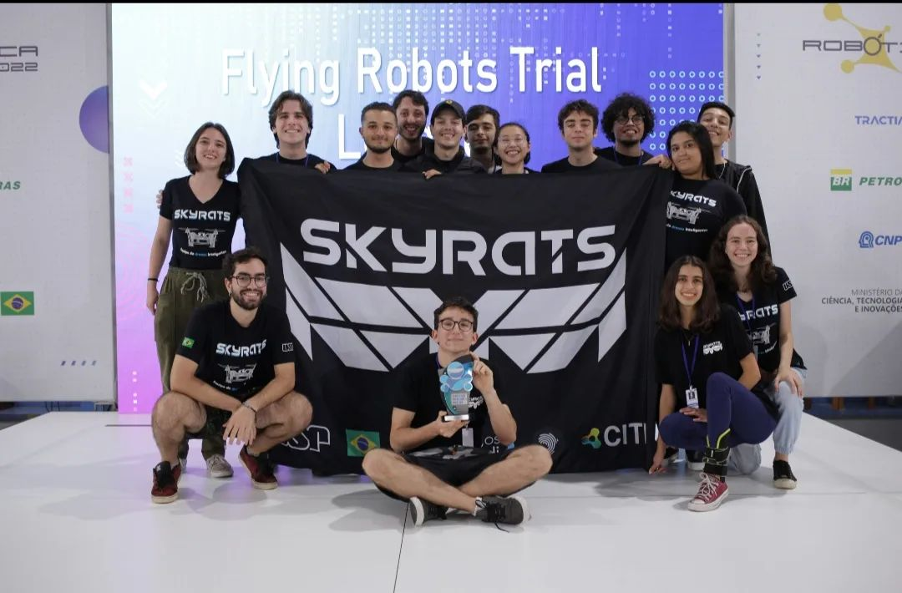
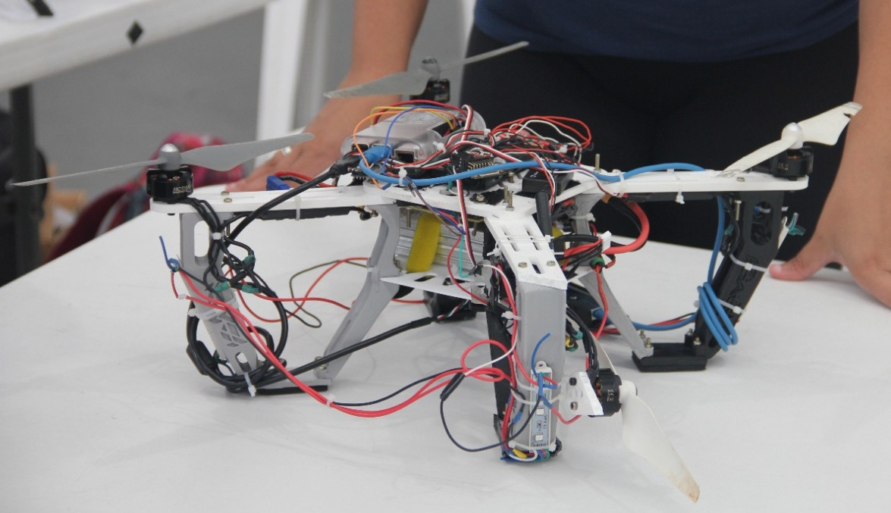

# CBR 2022 - EQUIPE SKYRATS

## 1° LUGAR - FLYING ROBOTS TRIAL LEAGUE 🎉🎉🎉
A competição consistiu de 4 Fases, cujas informações podem ser encontradas neste mesmo repositório, na pasta correspondente de cada fase. As tecnologias utilizadas (nas áreas  Mecânica, Hardware e Software) estão descritas no pdf do TDP (Team Description Paper).

## 2° LUGAR - TECHNICAL CHALLENGE 🎉🎉🎉

No Technical Challenge, a equipe apresentou as inovações 
utilizadas para a competição. Destacamos a mecânica
modular do drone, essencial para a rápida recuperção pós
impactos, e o calibrador de máscaras, utilizado para
a adaptação dos valores dos códigos de detecção às condições
reais da prova.
A apresentação completa pode ser assistida nesse  [link](https://www.instagram.com/tv/CkBAi-rAESy/?igshid=ZmRlMzRkMDU%3D).

 Imagem do drone utilizado na competição
