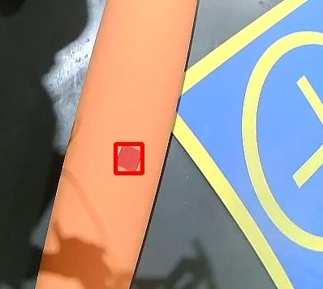
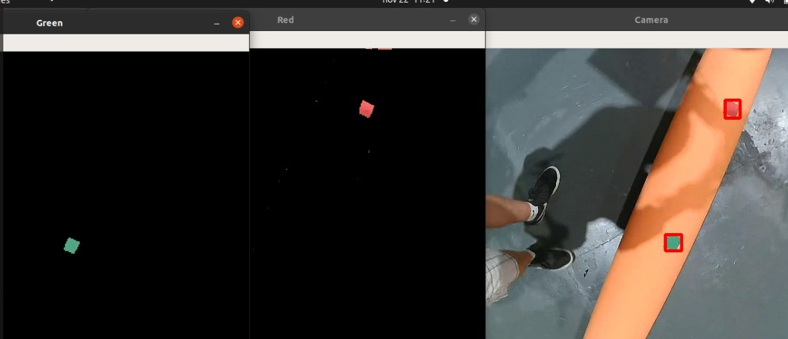

# CBR 22 - FASE 2
## PREVENÇÃO E SENSORIAMENTO - INSPEÇÃO

Na FASE 2, a tarefa é identificar quais sensores de monitoramento estão sinalizando defeito
na tubulação. Serão colocados 5 sensores de monitoramento no oleoduto, representado por
quadrados coloridos, de 5 cm de lado, nas cores vermelho ou verde, sendo vermelho o
sensor que está detectando o defeito. As coordenadas do tubo serão fornecidas.

## INFORMAÇÕES DO REGULAMENTO
### A TAREFA
- Nesta FASE 2, o drone deverá escanear o oleoduto e, à medida que for percorrendo o oleoduto, o drone deverá detectar cada sensor observado. É vedado ao drone o escaneamento rápido do oleoduto, ou sobrevoo do oleoduto completo para detectar simultaneamente todos os sensores.

- A detecção dos sensores deve ser feita à medida que o drone percorre o oleoduto. O drone não deve estar mais do que 1 m de altura acima do oleoduto. A altura do drone para o oleoduto deve ser mostrada na tela para o juiz.

- Quando o drone detectar a presença de um sensor, o drone deverá sinalizar na tela quais sensores estão sendo detectados (verde - sem defeito, ou vermelho - com defeito). Para cada sensor vermelho detectado, o drone deverá emitir um aviso sonoro de 3 segundos para o juiz.

- Após passar pelos 5 sensores, deverá voltar autonomamente para a base costeira. Ao voltar para a base costeira, a tentativa termina.

### CONDIÇÕES
- As posições dos sensores no tubo serão sorteados no momento da realização da tarefa para cada equipe e colocados em cima do Oleoduto. 

- Serão 3 sensores vermelhos e dois verdes no total.

- Nesta FASE, cada equipe terá 10 minutos corridos e até 3 tentativas. Valerá a maior pontuação obtida em uma tentativa.

-  Interação com o Humano: Nesta fase não há interação com humanos.
    
### PONTUAÇÃO
Esta fase possui uma pontuação máxima de 100 pontos.

Cada Sensor vermelho detectado pela primeira vez confere 10 pontos para a equipe. Para
cada sensor vermelho detectado, o drone deverá emitir um aviso sonoro de 3 segundos para
o juiz. Para cada sensor verde detectado pela primeira vez confere 10 pontos para a equipe.
Ambos os sensores verde e vermelho deverão ser detectados também com um aviso na tela
do computador da equipe.

As medições serão consideradas inválidas caso:

- O drone detecte o mesmo sensor vermelho mais de uma vez. Nesse caso, cada detecção repetida resultará na perda de 3 pontos.

- O drone detecte um sensor verde detectado erroneamente como vermelho ou um sensor vermelho detectado como verde. Nesse caso, cada detecção errada resultará na perda de 5 pontos.

Se o drone voltar para a base costeira sozinho (sem intervenção humana) após ler todos os
sensores, e se o drone pousar na base com sucesso, a equipe terá sua pontuação dobrada
(2x) caso a pontuação seja positiva. Caso a pontuação seja negativa, se o drone voltar para
base costeira, a equipe não pontua na tentativa. Se o drone não voltar para a base costeira, a
equipe pode optar por parar a simulação, sem penalidade, em qualquer momento ou quando
terminarem os 10 minutos.

Se a equipe decidir parar o drone a qualquer momento em uma tentativa, valerá a pontuação
até o momento da interrupção.

Todas as 3 tentativas devem ser feitas com o drone iniciando na base costeira.

## NOSSO CÓDIGO

### fase2.py
Código principal. Nele, há setadas as coordenadas 
do início e do fim do tubo. Ele faz o drone sair da base
e ir até o início do tubo.

Quando chega no início, se dirige 
para o final, enquanto roda a função de detecção de sensores (emitindo
o aviso sonoro quando necessário).

Caso encontre os 5 sensores do tubo, chegue ao final do 
tubo ou o tempo máximo estipulado no código para a finalização da fase tenha sido atingido, ele 
retorna para a base costeira e conclue a missão.

### fase2AlturaTubo.py
Código para rodar em paralelo ao principal, que
mostra na tela a altura do drone em relação ao 
tubo, de acordo com o exigido nas regras.

### buzzer.py
Classe com o buzzer para emitir o aviso sonoro 
quando um sensor vermelhor for detctado.

### sensorDetector.py
Classe para a detecção dos sensores.

Ela cria, para cada cor de sensor, uma lista com a contagem de sensores da cor correspondente que estão na tela. A cada iteração da função, essa lista é atualizada, removendo a contagem mais antiga e adicionando a recente. Caso a moda (valor de maior ocorrência) da lista mude, significa que houve uma alteração da quantidade de sensores na tela, ou seja, um novo sensor foi detectado ou um sensor já detectado saiu da tela.

Essa estratégia foi utilizada caso em uma das iterações a função não detecte o sensor na tela mesmo que ele esteja lá. Assim, mesmo que por algumas iterações o sensor não seja detectado, é a moda da lista que determina se ele está lá ou não. O número de iterações necessárias para que a não detecção realmente signifique que o sensor não está mais na tela é regulada pela tolerância (TOL), que é o tamanho da lista.

### Máscaras
Para a detectção em si dos quadrados, utlizamos a geração de máscaras de cores 
para selecionar somente os pixels da imagem dentro do range especificado.
O range é calibrado a partir do nosso [calibrador de mácaras](https://github.com/SkyRats/calibrador-cores)

